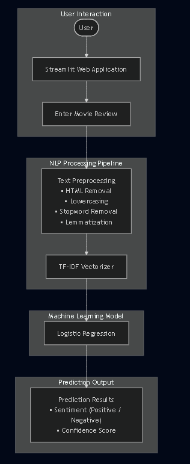
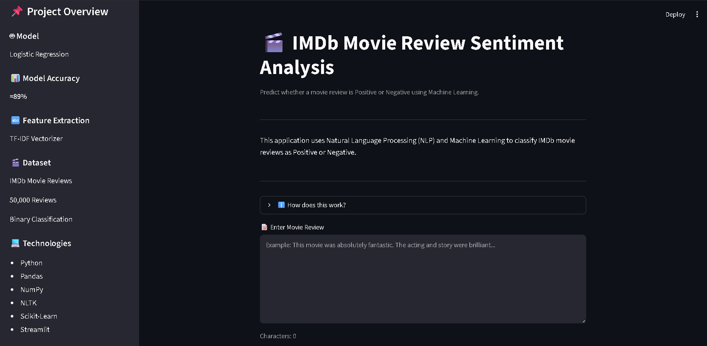
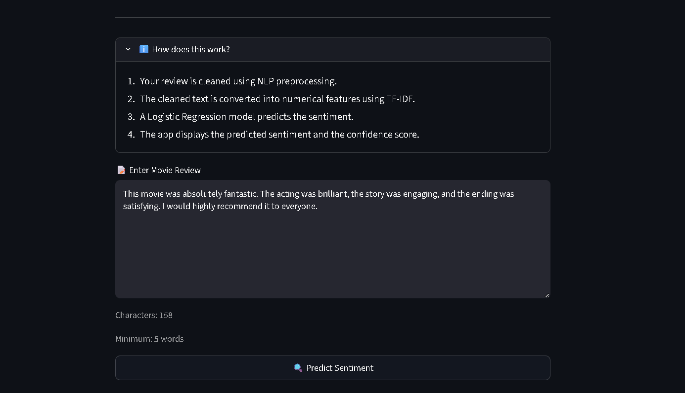
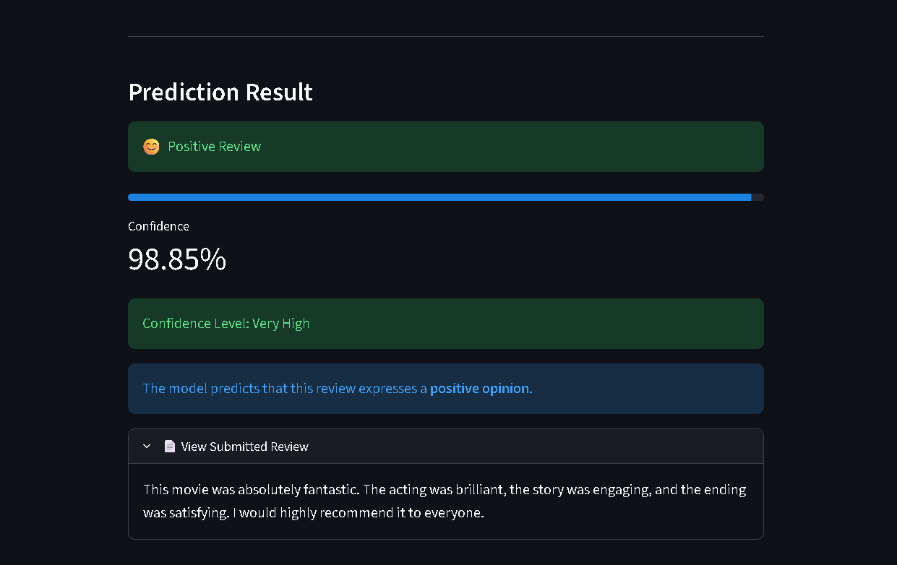
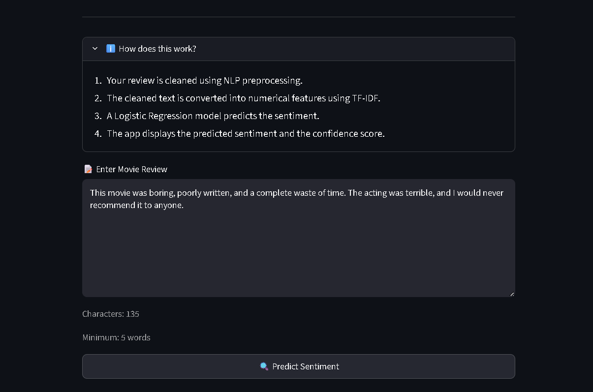
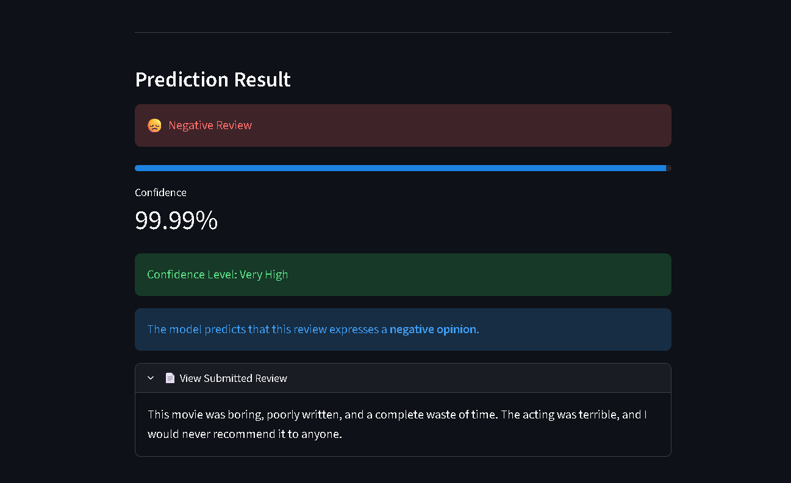
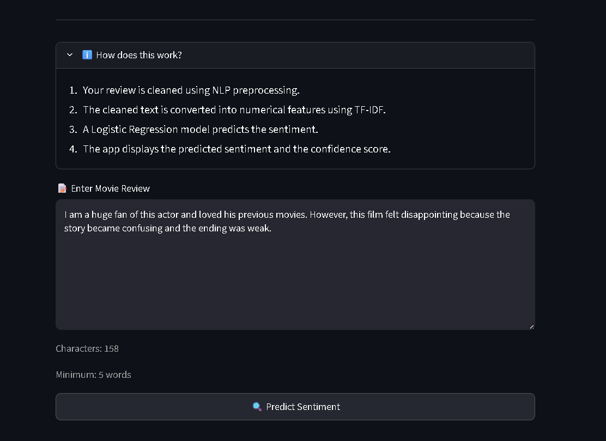
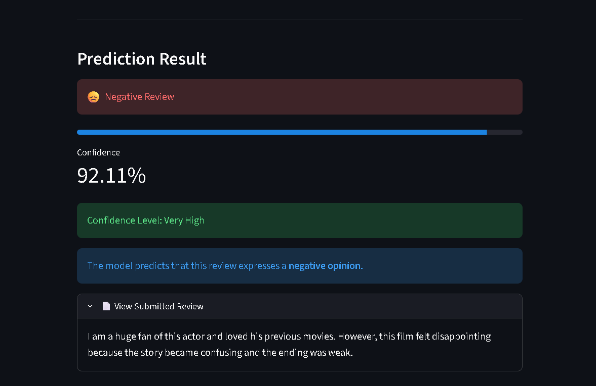

# 🎬 IMDb Movie Review Sentiment Analysis


An end-to-end Machine Learning project that predicts whether an IMDb movie review is **Positive** or **Negative** using **Natural Language Processing (NLP)** and **Logistic Regression**.

This project demonstrates the complete machine learning workflow, including data preprocessing, exploratory data analysis (EDA), feature engineering using TF-IDF, model training, evaluation, and deployment through an interactive Streamlit web application.

## 📖 Project Overview

Online movie reviews strongly influence how audiences choose what to watch. Manually analyzing thousands of reviews is both time-consuming and inefficient.

This project automates sentiment classification by using Natural Language Processing (NLP) and Machine Learning techniques to determine whether a movie review expresses a **positive** or **negative** opinion.

The project was developed to demonstrate an end-to-end machine learning workflow—from raw text preprocessing and exploratory data analysis to model training, evaluation, and deployment as a web application.

The final application allows users to enter any IMDb-style movie review and instantly receive:

- Predicted sentiment (Positive or Negative)
- Prediction confidence score
- User-friendly interface built with Streamlit


## 🚀 Project Highlights

- 🎯 End-to-end Machine Learning project for binary sentiment classification
- 🎬 Trained on the IMDb Movie Reviews Dataset (50,000 labeled reviews)
- 🧹 Complete NLP preprocessing pipeline using NLTK
- 🔤 TF-IDF feature engineering for text vectorization
- 🤖 Final model: Logistic Regression (~89% test accuracy)
- 🌐 Interactive web application built with Streamlit
- 📊 Exploratory Data Analysis (EDA) with visualizations
- 📁 Modular project structure following software engineering best practices
- 🏗️ Includes architecture and machine learning workflow diagrams
- 📖 Well-documented repository with deployment and usage instructions


## ✨ Features

- Interactive Streamlit web application
- NLP-based text preprocessing pipeline
- HTML tag and URL removal
- Stopword removal and lemmatization
- TF-IDF feature extraction
- Logistic Regression sentiment classifier
- Model confidence score
- Example reviews for testing
- Clean and modular project structure
- Jupyter notebooks for EDA and model training

## 🛠️ Technologies Used

| Category | Technologies |
|----------|--------------|
| Programming Language | Python |
| Data Analysis | Pandas, NumPy |
| Visualization | Matplotlib, Seaborn, WordCloud |
| NLP | NLTK |
| Machine Learning | Scikit-Learn |
| Feature Engineering | TF-IDF Vectorizer |
| Model | Logistic Regression |
| Web Application | Streamlit |
| Version Control | Git & GitHub |


## 🏗 Project Architecture


## 🔄 Machine Learning Workflow



## 📁 Project Structure

```text
IMDb-Movie-Review-Sentiment-Analysis/
│
├── app.py
├── README.md
├── LICENSE
├── requirements.txt
├── .gitignore
│
├── assets/
│   ├── architecture/
│   │   ├── project_architecture.svg
│   │   └── ml_workflow.svg
│   │
│   └── screenshots/
│       ├── home_page.png
│       ├── positive_prediction_input.png
│       ├── positive_prediction_output.png
│       ├── negative_prediction_input.png
│       ├── negative_prediction_output.png
│       ├── mixed_prediction_input.png
│       └── mixed_prediction_output.png
│
├── data/
│
├── models/
│   ├── sentiment_model.pkl
│   └── tfidf_vectorizer.pkl
│
├── notebooks/
│   ├── eda.ipynb
│   └── model_training.ipynb
│
├── src/
│   ├── data_loader.py
│   ├── preprocessing.py
│   ├── feature_engineering.py
│   ├── predictor.py
│   └── train_model.py
│
└── visualizations/
    ├── sentiment_distribution.png
    ├── review_length_distribution.png
    ├── wordcloud_positive.png
    ├── wordcloud_negative.png
    ├── model_comparison.png
    └── confusion_matrix.png
```


## 📊 Dataset

This project uses the **IMDb Movie Reviews Dataset**, one of the most widely used benchmark datasets for binary sentiment classification.

> **Note:** The dataset files are not included in this repository because of GitHub's file size limitations.
>
> Download the IMDb Movie Reviews Dataset from Kaggle:
>
> https://www.kaggle.com/datasets/lakshmi25npathi/imdb-dataset-of-50k-movie-reviews
>
> After downloading, place the dataset in the `data/` directory before running the notebooks or retraining the model.


### Dataset Information

- Total Reviews: **50,000**
- Positive Reviews: **25,000**
- Negative Reviews: **25,000**
- Balanced Dataset
- Binary Classification Problem

Each review is labeled as either:

- Positive
- Negative

The balanced nature of the dataset helps reduce model bias during training.


## 📊 Exploratory Data Analysis (EDA)

Before training the machine learning models, exploratory data analysis (EDA) was performed to understand the dataset and identify useful patterns.

The analysis includes:

- Sentiment distribution of movie reviews
- Review length distribution
- Positive review word cloud
- Negative review word cloud
- Model comparison visualization
- Confusion matrix

All generated figures are available in the `visualizations/` directory.


## 🧹 Data Preprocessing

Before training the machine learning model, each review undergoes a complete NLP preprocessing pipeline.

### Preprocessing Steps

- Remove HTML tags
- Remove URLs
- Convert text to lowercase
- Remove punctuation
- Remove numerical values
- Remove English stopwords
- Perform lemmatization
- Remove extra spaces

These preprocessing steps help reduce noise and improve the quality of the features extracted by the TF-IDF vectorizer.


## 🔤 Feature Engineering

The cleaned text is transformed into numerical features using **TF-IDF (Term Frequency–Inverse Document Frequency)**.

### TF-IDF Parameters

| Parameter | Value |
|-----------|------:|
| max_features | 5000 |
| min_df | 2 |
| max_df | 0.8 |

TF-IDF assigns higher importance to informative words while reducing the influence of extremely common words, resulting in a more effective numerical representation of the reviews.


## 🤖 Model Training

Two machine learning algorithms were trained and evaluated.

| Model | Purpose |
|--------|----------|
| Multinomial Naive Bayes | Baseline Model |
| Logistic Regression | Final Model |

The dataset was split using an **80:20 Train-Test Split**.

Training Data:
- 40,000 Reviews

Testing Data:
- 10,000 Reviews

Logistic Regression achieved the best overall performance and was selected as the final model for deployment.


## 📈 Model Performance

The trained models were evaluated on the IMDb Movie Reviews test dataset.

| Model | Accuracy |
|--------|---------:|
| Multinomial Naive Bayes | ~85% |
| Logistic Regression | **~89%** ✅ |

Logistic Regression achieved the highest accuracy and demonstrated better overall performance, making it the final model selected for deployment.

In addition to accuracy, the models were evaluated using:

- Confusion Matrix
- Precision
- Recall
- F1-Score

These evaluation metrics provided a more comprehensive assessment of model performance beyond overall accuracy.


## 💾 Saved Model Artifacts

After training, the final machine learning artifacts are stored in the `models/` directory.

These include:

- `sentiment_model.pkl` — Trained Logistic Regression model
- `tfidf_vectorizer.pkl` — Fitted TF-IDF vectorizer

These files are loaded by the Streamlit application to perform real-time sentiment prediction.

## 🖥️ Streamlit Web Application

A user-friendly Streamlit web application was developed to make the trained model easily accessible.

### Features

- Enter any movie review
- Predict sentiment instantly
- Display confidence score
- Show confidence level
- Built-in example reviews
- Review validation
- Interactive and responsive interface

The application uses the saved TF-IDF vectorizer and Logistic Regression model to generate real-time predictions.


## 🚀 Installation

### 1. Clone the repository

```bash
git clone https://github.com/VonDominion/Latveria-Labs.git
```

### 2. Move into the project directory

```bash
cd Latveria-Labs
```

### 3. Create a virtual environment

```bash
python -m venv venv
```

### 4. Activate the virtual environment

**Windows**

```bash
venv\Scripts\activate
```

**macOS / Linux**

```bash
source venv/bin/activate
```

### 5. Install dependencies

```bash
pip install -r requirements.txt
```

### 6. Run the Streamlit application

```bash
streamlit run app.py
```

After the server starts, open the URL displayed in your terminal (usually `http://localhost:8501`) in your web browser.


## ⚠️ Model Limitations

Although the Logistic Regression model achieves approximately **89% accuracy**, it is not perfect and has some limitations.

- The model uses **TF-IDF**, which represents text based on word importance rather than understanding sentence meaning or context.
- Reviews containing **mixed sentiments**, sarcasm, irony, or complex sentence structures may be misclassified.
- The model was trained specifically on the **IMDb Movie Reviews Dataset**, so its performance on reviews from other domains may differ.

### Example

The following review was predicted as **Positive**, even though its overall sentiment is **Negative**:

> "I am a big fan of this actor and all his movies are truly great... but this movie was disappointing... the plot twist was very bad... really dissatisfied."

This happens because the review contains both strong positive and strong negative expressions. Traditional machine learning models such as TF-IDF with Logistic Regression learn statistical word patterns rather than understanding the complete context of a sentence.

These limitations are common in traditional NLP approaches and provide opportunities for future improvements using transformer-based language models.


## 🔮 Future Improvements

Possible enhancements for future versions of this project include:

- Improve preprocessing techniques
- Experiment with Support Vector Machines (SVM)
- Hyperparameter tuning
- Use transformer-based models such as BERT or RoBERTa
- Support multilingual sentiment analysis
- Add batch prediction from CSV files
- Provide explainable AI (XAI) visualizations for model predictions
- Allow users to upload multiple reviews for bulk sentiment analysis


## 📸 Application Screenshots

### 🏠 Home Page

The home page provides an intuitive interface where users can enter a movie review, explore the project workflow, and access example reviews.

<p align="center">
  
</p>

---

## 😊 Positive Review Prediction

### Input

<p align="center">
  
</p>

### Output

<p align="center">
  
</p>

The model correctly classifies the review as **Positive** and displays the confidence score.

---

## 😞 Negative Review Prediction

### Input

<p align="center">
  
</p>

### Output

<p align="center">
  
</p>

The model correctly predicts the review as **Negative** along with its confidence score.

---

## 🤔 Mixed Review Prediction

### Input

<p align="center">
  
</p>

### Output

<p align="center">
  
</p>

This example demonstrates one of the limitations of traditional machine learning models. Since the review contains both positive and negative opinions, the TF-IDF + Logistic Regression model relies on statistical word patterns rather than understanding the complete context, which may lead to an incorrect prediction.


## 🚀 Live Demo

🌐 **Project Doom**

https://project-doom.streamlit.app


## 👨‍💻 Author

**Naitik Tiwari**

Third-Year B.Tech Student  
Computer Science & Engineering

### Connect with Me

- GitHub: https://github.com/VonDominion

### Interests

- Machine Learning
- Data Analytics
- Natural Language Processing (NLP)
- Python Development


## 📄 License

This project is licensed under the MIT License.

Feel free to use, modify, and learn from this project with proper attribution.


                    


